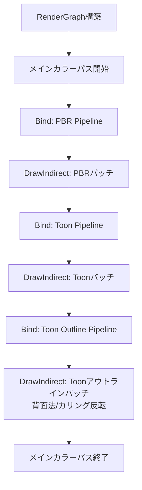

# PBR & Toon ハイブリッドアーキテクチャ設計案

PBR（物理ベース）とToon（アニメ調）では、求められる計算もパラメータも全く異なります。これらを同じ画面内で破綻なく、かつ効率よく描画するためのアーキテクチャ案です。

## 1. 求められる要件と違い

| 要素 | PBR (Physical Based Rendering) | Toon (Cel Shading) |
| :--- | :--- | :--- |
| **パラメータ** | Metallic, Roughness, Normal, F0など | ShadeColor(影色), Threshold(影の境界), OutlineWidth, MatCapなど |
| **ライティング** | Cook-Torrance BRDF, IBL(環境光) | 段階的なステップシェーディング, カスタム影ベクトル, リムライト |
| **描画パス** | 通常のForward（またはDeferred）1パス | 通常パス ＋ **アウトライン描画パス（背面法など）** の2パス構成が多い |

このように、Toonは「アウトライン」という物理的にありえない描画パスを要求するため、PBRと全く同じパイプラインで描画するのは不可能です。

## 2. 提案するアーキテクチャ：パイプライン分離型（Multi-Pipeline Forward）

メガシェーダー（1つのシェーダー内でPBRとToonをif文で分岐）にするのではなく、**「PBRパイプライン」と「Toonパイプライン」を完全に分離**し、CPU側で描画コマンドを出し分ける設計を提案します。

### ① マテリアルとインスタンスの分類 (CPU側)
エンジン側（C++）の `MaterialData` を「PBR用」と「Toon用」で分けます（あるいはUnion/std::variant等で管理）。
描画（`draw_frame`）の際、すべてのインスタンスを以下のバッチに振り分けます。
1. PBRインスタンスリスト
2. Toonインスタンスリスト

### ② ObjectData (SSBO) の汎用化
現在SSBOに直接 `MaterialData` の構造体を書き込んでいますが、これを「汎用的なデータ配列」にします。

```slang
// シェーダー共通のSSBOレイアウト
struct ObjectData {
    float4x4 model_matrix;
    uint data[8]; // マテリアルによって中身の解釈を変える汎用ペイロード
};
```
- **PBRパイプライン実行時**： `data[0]`〜`data[3]` を Metallic, Roughness, TextureID として解釈（キャスト）して計算。
- **Toonパイプライン実行時**： `data[0]`〜`data[3]` を ShadeColor, Threshold, OutlineWidth として解釈して計算。

これにより、バッファの仕組み自体は変えずに、複数のマテリアルタイプを共存させられます。

### ③ 描画フロー (FrameGraph)


## 3. 今後の実装ステップ

もしこの「パイプライン分離型」の設計で合意いただければ、以下のステップで実装を進めます。

1. **C++側のマテリアル構造の抽象化**
    - `MaterialType` enumの導入
    - `MaterialData` を汎用化（または PbrMaterial / ToonMaterial の構造体定義）
    - `VulkanRenderer` 内でインスタンスをタイプ別に振り分けるロジックの追加
2. **SSBO (ObjectData) のペイロード化**
    - CPUからGPUへ渡す構造体を「汎用データ領域」に改修
3. **Slangシェーダーの分割**
    - `main.slang` を `pbr_shader.slang` と `toon_shader.slang`（+アウトライン用）に分割
4. **Vulkan Pipeline の複数作成**
    - `vulkan_renderer_init.cpp` で PBR 用と Toon 用（+アウトライン用）のパイプラインをそれぞれ生成し、切り替えてバインドできるようにする

---
メガシェーダー化やGBuffer（Deferred）化などの別案もありますが、拡張性とToon表現の自由度（アウトライン等）を考えると、このパイプライン分離型が最もおすすめです。いかがでしょうか？
